<div align="center">

<br/>

# REHAB AI
### AI-Powered Physiotherapy & Recovery Monitoring System

<br/>

[](https://python.org)
[](https://fastapi.tiangolo.com)
[](https://react.dev)
[](https://mongodb.com)
[](https://tensorflow.org)
[](https://mediapipe.dev)
[](LICENSE)

<br/>

> A full-stack, AI-driven physiotherapy platform enabling real-time exercise monitoring via CNN-BiLSTM pose classification, calorie prediction through stacking ensemble learning, and structured doctor-patient collaboration — engineered with advanced data structures, a custom TCP protocol implementing Reno congestion control, and Huffman-compressed data transport.


---

</div>

## Table of Contents

1. [Problem Statement](#1-problem-statement)
2. [Solution Overview](#2-solution-overview)
3. [System Architecture](#3-system-architecture)
   - [Layered Architecture Diagram](#31-layered-architecture-diagram)
   - [System Block Diagram](#32-system-block-diagram)
   - [Component Interaction Graph](#33-component-interaction-graph)
4. [Technology Stack](#4-technology-stack)
5. [Key Features](#5-key-features)
6. [ML Pipeline — Exercise Classification](#6-ml-pipeline--exercise-classification)
   - [Architecture & Intuition](#61-architecture--intuition)
   - [Model Specification](#62-model-specification)
   - [Biomechanical Joint Angles](#63-biomechanical-joint-angles)
   - [Training Data & Augmentation](#64-training-data--augmentation)
   - [Performance Evaluation](#65-performance-evaluation)
7. [ML Pipeline — Calorie Prediction](#7-ml-pipeline--calorie-prediction)
   - [Architecture & Intuition](#71-architecture--intuition)
   - [Ensemble Design](#72-ensemble-design)
   - [Performance Evaluation](#73-performance-evaluation)
8. [Data Structures & Algorithms](#8-data-structures--algorithms)
9. [Computer Networks & Custom TCP Protocol](#9-computer-networks--custom-tcp-protocol)
10. [Screenshots](#10-screenshots)
11. [Project Structure](#11-project-structure)
12. [Getting Started](#12-getting-started)
13. [Environment Variables](#13-environment-variables)
14. [API Reference](#14-api-reference)
15. [Contributors](#15-contributors)

---

## 1. Problem Statement

Existing AI-assisted physiotherapy systems present several unresolved limitations that hinder clinical adoption and patient outcomes:

| Limitation | Description |
|---|---|
| **Lack of clinical validation** | Very few randomized controlled trials; reported outcomes remain inconsistent across deployments |
| **Limited personalization** | Generic rehabilitation programs fail to maintain engagement over time |
| **High cost barriers** | VR systems, robotic devices, and wearable sensors are expensive and inaccessible in resource-constrained settings |
| **Privacy concerns** | Wearable sensors raise data privacy issues, and sensor reliability varies across device types |

These gaps collectively prevent widespread, equitable access to evidence-based, technology-assisted physiotherapy.

---

## 2. Solution Overview

REHAB AI addresses these gaps through a **comprehensive, web-based, sensor-less rehabilitation platform** designed for clinical integration.

| Gap | REHAB AI's Approach |
|---|---|
| **Clinical Validation** | CNN + BiLSTM model with MediaPipe provides real-time, quantitative posture analysis across 8 standardized biomechanical joint angles |
| **Accessibility** | Camera-based monitoring — no wearables or specialized hardware required; compatible with any webcam-enabled device |
| **Workflow Integration** | Role-based dashboards for patients and doctors with automated alerts, risk stratification, and compliance monitoring |
| **Data Privacy** | Secure FastAPI backend, TLS-encrypted custom TCP transport, token-based video access, and environment-based credential management |
| **Human Oversight** | AI augments — not replaces — the therapist. Critical anomalies trigger clinician alerts for direct intervention |
| **Longitudinal Evidence** | Tracks exercises, adherence, pain feedback, wellness metrics, and recovery trends over extended periods |

<p align="center">
  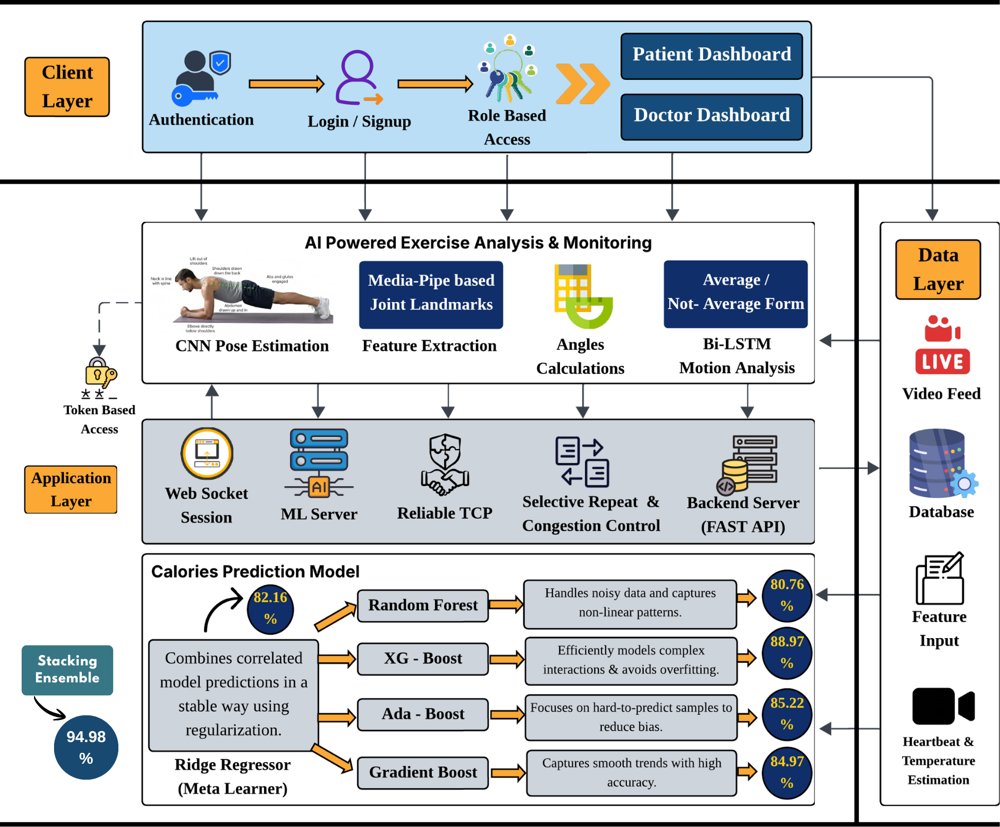
  <br/>
  <em>Figure 1 — REHAB AI Methodology </em>
</p>


---

## 3. System Architecture

The system operates as four concurrent, independently managed services:

| # | Service | Technology | Port |
|---|---|---|---|
| 1 | **Frontend** | React 19 + Vite | `:5173` |
| 2 | **Backend API** | FastAPI + Uvicorn | `:8000` |
| 3 | **ML Inference Service** | FastAPI + TensorFlow | `:8001` |
| 4 | **TCP Transport Server** | Custom TCP + TLS | `:65432` |

### 3.1 Layered Architecture Diagram

The following diagram illustrates the system's four-tier organization — Client, Application, Data, and External Services — and the bidirectional data flows between them.

<p align="center">
  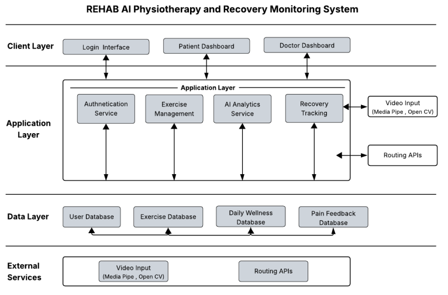
  <br/>
  <em>Figure 2 — REHAB AI architecture diagram</em>
</p>

### 3.2 System Block Diagram

The block diagram below depicts the end-to-end signal and control flow: from input sources (patient wellness data, doctor assignments, and live camera feed) through the central FastAPI processing system to the patient and doctor output dashboards.

<p align="center">
  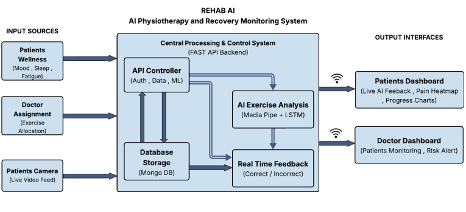
  <br/>
  <em>Figure 3 — REHAB AI system block diagram </em>
</p>

**Data flow summary:** The React frontend captures webcam frames via MediaPipe and streams 33-body-landmark data to the ML Service over WebSocket. The ML Service performs BiLSTM inference and returns real-time corrective feedback. On session completion, a Huffman-compressed session report is transmitted to the Backend TCP Server over a TLS-encrypted, reliable custom TCP channel (with Reno congestion control), where it is persisted to MongoDB Atlas. Doctor and patient dashboards consume this data through the REST API layer.

---

## 4. Technology Stack

| Layer | Technology | Purpose |
|---|---|---|
| **Frontend** | React 19, Vite, Tailwind CSS | UI framework, build tooling, utility-first styling |
| **Animations** | Framer Motion | Micro-animations and page transitions |
| **Charts** | Recharts | Data visualization (line, pie, bar, area charts) |
| **Pose Detection** | MediaPipe Pose (Browser) | Real-time 33-landmark body pose detection |
| **Backend** | FastAPI, Uvicorn | Async Python API server |
| **Database** | MongoDB Atlas (PyMongo) | Cloud-hosted NoSQL document store |
| **Exercise ML** | TensorFlow / Keras BiLSTM | Sequential pose classification model |
| **Calorie ML** | XGBoost, Random Forest, Gradient Boosting, AdaBoost, Ridge | Stacking ensemble regression |
| **Computer Vision** | OpenCV, MediaPipe | Vital sign extraction, pose preprocessing |
| **Signal Processing** | NumPy, SciPy (FFT) | Heart rate extraction from PPG signal |
| **Compression** | Custom Huffman Coding | Lossless joint angle data compression |
| **Transport** | Custom TCP + TLS + Reno | Reliable, encrypted session data delivery |
| **Security** | Werkzeug, python-dotenv | Password hashing, secret management |

---

## 5. Key Features

### Patient Dashboard

- **AI Exercise Video Feed** — Real-time pose analysis with webcam using MediaPipe + BiLSTM, providing instant corrective feedback
- **Exercise Management** — View assigned exercises with deadlines, completion status, and priority-sorted ordering
- **Recovery Score Tracking** — Composite metric combining pain, mood, sleep, fatigue, and adherence consistency
- **Interactive Pain Body Heatmap** — Anatomical body diagram with multi-region selection and intensity slider reporting
- **Daily Wellness Check-in** — Emoji-based mood, sleep quality, and fatigue logging
- **Performance Analytics** — Session-by-session charts with per-exercise confidence and accuracy metrics
- **Calorie Predictor** — Camera-based vital signs extraction feeding the ML calorie burn prediction pipeline
- **Activity Heatmap** — GitHub-style contribution heatmap visualizing daily engagement patterns

### Doctor Dashboard

- **Patient Management** — Trie-based fast search with stable alphabetical sorting across patient lists
- **Exercise Assignment** — Prescribe targeted exercises with custom durations and 24-hour deadline enforcement
- **Recovery Trend Charts** — Cohort-wide and per-patient longitudinal recovery trend visualizations
- **Risk Stratification** — Patients ranked by weighted multi-factor risk score for clinical prioritization
- **Critical Alerts** — Min-Heap priority queue surfacing at-risk patients requiring immediate attention
- **Pain Management Overview** — Aggregated pain reports with body region frequency analysis
- **Exercise Compliance** — Per-patient completion rates and overall compliance metric tracking

---

## 6. ML Pipeline — Exercise Classification

### 6.1 Architecture & Intuition

Physiotherapy posture assessment requires understanding both **spatial structure** — what a pose looks like at a given instant — and **temporal dynamics** — how a pose evolves throughout the execution of a movement. REHAB AI employs a hybrid CNN-BiLSTM architecture to address both dimensions.

The processing pipeline is organized as follows:

**Stage 1 — Spatial Feature Extraction (MediaPipe + Pose Graph)**
Raw webcam frames are processed by MediaPipe Pose, which detects 33 body landmarks in real time. These landmarks are mapped onto a custom skeletal graph (adjacency list), where joints are nodes and bones are edges. Eight clinically significant joint angles are then computed via the vector dot-product formula:

$$\theta = \arccos\left(\frac{\vec{BA} \cdot \vec{BC}}{\|\vec{BA}\| \cdot \|\vec{BC}\|}\right)$$

This graph representation encodes spatial biomechanical relationships while remaining invariant to absolute body position, size, and camera distance.

**Stage 2 — Temporal Modeling (BiLSTM)**
The extracted angle sequences are accumulated in a sliding window of 32 consecutive frames using a deque buffer. This temporal window is passed to a three-layer Bidirectional LSTM, which captures both forward and backward temporal dependencies — detecting gradual postural degradation, movement transitions, and consistency of joint alignment over time.

Bidirectional processing is essential here: correct exercise form is characterized not only by where joints are at a given frame, but also by how smoothly and symmetrically the movement unfolds in both directions through the sequence.

**Stage 3 — Attention & Classification**
An attention mechanism assigns learned weights to each timestep in the sequence, focusing the model on the frames most diagnostically relevant. The attended representation is passed through two dense layers with L2 regularization and dropout, producing a binary output: **Correct Form** or **Incorrect Form**.


### 6.2 Model Specification

| Component | Configuration |
|---|---|
| **Input Shape** | 32 timesteps × 8 joint angles |
| **BiLSTM Layer 1** | 128 units, return sequences → Dropout(0.5) → BatchNormalization |
| **BiLSTM Layer 2** | 64 units, return sequences → Dropout(0.5) → BatchNormalization |
| **BiLSTM Layer 3** | 64 units (attention query source) |
| **Attention** | tanh activation → Softmax normalization over timesteps |
| **Dense Layer 1** | 64 units + L2(0.002) + Dropout(0.6) |
| **Dense Layer 2** | 32 units + L2(0.002) + Dropout(0.4) |
| **Output Layer** | Dense(1) + Sigmoid — binary classification |
| **Optimizer** | Adam (lr = 0.0005) |
| **Loss Function** | Binary Cross-Entropy with class weighting (1.5× minority) |

### 6.3 Biomechanical Joint Angles

The eight angles were selected based on their clinical significance across the exercise types included in the training corpus:

| # | Joint Angle | Landmark Triplet | Clinical Significance |
|---|---|---|---|
| 1 | Left Hip | Shoulder → Hip → Knee | Trunk alignment; plank and squat form |
| 2 | Right Hip | Shoulder → Hip → Knee | Trunk alignment; plank and squat form |
| 3 | Left Elbow | Shoulder → Elbow → Wrist | Arm support position and load distribution |
| 4 | Right Elbow | Shoulder → Elbow → Wrist | Arm support position and load distribution |
| 5 | Left Shoulder | Elbow → Shoulder → Hip | Upper body posture and overhead alignment |
| 6 | Right Shoulder | Elbow → Shoulder → Hip | Upper body posture and overhead alignment |
| 7 | Left Knee | Hip → Knee → Ankle | Lower-limb posture; squat and lunge form |
| 8 | Right Knee | Hip → Knee → Ankle | Lower-limb posture; squat and lunge form |

### 6.4 Training Data & Augmentation

| Source | Volume | Description |
|---|---|---|
| **qual.com** | ~200,000 videos (~80 GB) | Primary labeled exercise dataset |
| **Kaggle** | ~1,000 videos (~16 GB) | Supplementary exercise data |

Each exercise was captured across **14 distinct variations** covering differences in execution speed, camera viewpoint, body type, and lighting conditions to improve generalization.

**Augmentation Pipeline:**

Raw frames were expanded from ~20,000 to ~45,000 through the following transformations:

- Horizontal flipping, rotation, scaling, and translation
- Gaussian noise injection (σ = 3) for minority class stabilization
- Time warping with scaling factor range 0.85–1.15×
- 3× oversampling of minority class instances
- Class weighting with 1.5× importance assigned to minority samples

### 6.5 Performance Evaluation

| Metric | Score |
|---|---|
| **Accuracy** | 83.5% |
| **Precision** | 84.5% |
| **Recall** | 82.0% |
| **F1-Score** | 83.2% |
| **AUC** | 0.83 (validation set) |

**Confusion Matrix** (evaluated on 2,000 held-out samples):

| | Predicted: Correct Form | Predicted: Incorrect Form |
|---|---|---|
| **Actual: Correct Form** | TP = 820 | FN = 180 |
| **Actual: Incorrect Form** | FP = 150 | TN = 850 |

---

## 7. ML Pipeline — Calorie Prediction

### 7.1 Architecture & Intuition

Accurate calorie prediction requires integrating physiological signals (heart rate, body temperature) with anthropometric and session-level features. A single model tends to capture either variance or bias effectively, but rarely both simultaneously. REHAB AI employs **stacking ensemble learning** — a meta-learning strategy that trains a secondary model on the predictions of multiple diverse base learners — to achieve both low bias and low variance, which is particularly critical in healthcare applications where prediction reliability directly impacts clinical guidance.

**Vital Sign Extraction Pipeline:**

Before reaching the ML model, raw physiological inputs are derived from the webcam feed alone, without any wearable sensors:

1. **Heart Rate (BPM):** MediaPipe Face Mesh detects the user's face. The green channel of the facial skin region is sampled across frames to extract a remote photoplethysmography (PPG) signal. A bandpass FFT filter isolates the cardiac frequency component, and the dominant frequency is converted to beats per minute.

2. **Body Temperature:** A thermal proxy ratio is computed from the relative intensity of facial color channels, providing an estimated skin temperature reading.

These extracted vitals, combined with user-supplied anthropometric data (age, height, weight, BMI, session duration, gender), form the complete feature vector for calorie prediction.

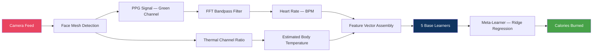

### 7.2 Ensemble Design

Each base learner was selected for a distinct learning strategy, providing the meta-learner with complementary prediction signals:

| Model | Role in Ensemble |
|---|---|
| **Random Forest** | Variance reduction via bootstrap aggregation; robust to noisy features; provides feature importance estimates |
| **XGBoost** | Regularized gradient boosting; handles missing values; high computational efficiency |
| **Gradient Boosting** | Sequential error correction via gradient descent in function space |
| **AdaBoost** | Adaptive sample weighting; focuses subsequent learners on difficult-to-predict instances |
| **Ridge Regression** | Low-variance linear baseline that stabilizes ensemble outputs and prevents over-specialization |

The **meta-learner** (Ridge Regression) is trained on out-of-fold predictions from the base learners, learning which combination of model outputs minimizes prediction error on unseen data.

**Input Features:** Gender, Age, Height, Weight, Duration, Heart Rate, Body Temperature, BMI → **Target: Calories Burned**

### 7.3 Performance Evaluation

| Model | RMSE | R² Score | MAE |
|---|---|---|---|
| **Stacking Ensemble** | **Lowest** | **~0.95** | Very Low |
| Random Forest | Low | Moderate | **Lowest** |
| XGBoost | Low | High | Moderate |
| Gradient Boosting | Low | Moderate | Moderate |
| AdaBoost | High | Moderate | High |
| Ridge Regression | High | Low | High |

The stacking ensemble achieves the best overall predictive accuracy (R² ≈ 0.95) and lowest RMSE across test folds. Random Forest produces the most consistent average predictions (lowest MAE), making it the strongest individual base learner. The ensemble outperforms all individual models by effectively combining their complementary strengths.

---

## 8. Data Structures & Algorithms

### Data Structures

| Structure | Location | Purpose | Complexity |
|---|---|---|---|
| **Trie (Prefix Tree)** | `db_connection.py` | Patient name search and alphabetical sorting | O(k) search / insert |
| **Min-Heap** | `db_connection.py` | Overdue exercise detection, deadline prioritization | O(log n) insert, O(1) min |
| **Graph (Adjacency List)** | `pose_graph.py` | Skeletal structure — joints as nodes, bones as edges | O(V+E) traversal |
| **Huffman Tree** | `huffman_compression.py` | Lossless compression of angle data before transport | O(n log n) build |
| **Hash Tables** | `db_connection.py` | O(1) patient profile retrieval, exercise lookup by ID | O(1) average |
| **Circular Queue** | `tcp_control_flow/` | Fixed-size buffer for pose packet reordering | O(1) enqueue / dequeue |
| **Deque** | `pose_analysis.py` | Fixed-size 32-frame sliding window for angle sequences | O(1) append / pop |
| **Sorted Dictionary** | `db_connection.py` | Chronological pain tracking with efficient range queries | O(log n) insert |
| **Dynamic Array** | `pose_analysis.py` | Time-series joint angle trajectory accumulation | O(1) amortized append |

### Algorithms

| Algorithm | Location | Purpose |
|---|---|---|
| **Binary Search** | `db_connection.py` | O(log n) exercise lookup by date using `bisect_left` / `bisect_right` |
| **Greedy Scheduling** | `db_connection.py` | Optimal exercise sequencing ordered by deadline and severity |
| **DFS Recursion** | `db_connection.py` | Depth-first Trie traversal for autocomplete suggestions |
| **Merge Sort** | `db_connection.py` | Stable sorting of exercises and recovery data records |
| **Composite Scoring** | `db_connection.py` | Weighted recovery index: pain (40%) + consistency (20%) + sleep (15%) + mood (15%) + fatigue (10%) |
| **7-Day Rolling Average** | `db_connection.py` | Recovery trend classification: improving / stable / declining |
| **FFT Signal Processing** | `predict1.py` | Heart rate extraction from PPG signal via bandpass frequency filtering |
| **Vector Angle Computation** | `pose_graph.py` | Joint angle calculation: θ = arccos(BA · BC / ‖BA‖ · ‖BC‖) |

---

## 9. Computer Networks & Custom TCP Protocol

### Networking Concepts Applied

| Concept | Implementation |
|---|---|
| **Client-Server Architecture** | React frontend communicates with FastAPI backend over HTTP/REST |
| **REST API** | JSON-based GET/POST endpoints for all CRUD operations |
| **WebSockets** | Real-time bidirectional streaming for pose analysis and vital sign collection |
| **Custom Application Protocol** | Structured telemetry packets with sequence numbers, timestamps, and checksums |
| **TLS/SSL Encryption** | All TCP socket communication encrypted with self-signed certificates |
| **CORS Policy** | Strict cross-origin access control on all API routes |
| **Token-Based Authorization** | Cryptographic single-use tokens gating video feed access |

### Custom TCP Reliable Transfer Protocol

Session data is transmitted from the ML Service to the Backend using a custom application-layer protocol built on top of raw TCP sockets, implementing reliable delivery semantics manually rather than relying solely on OS-level TCP guarantees.

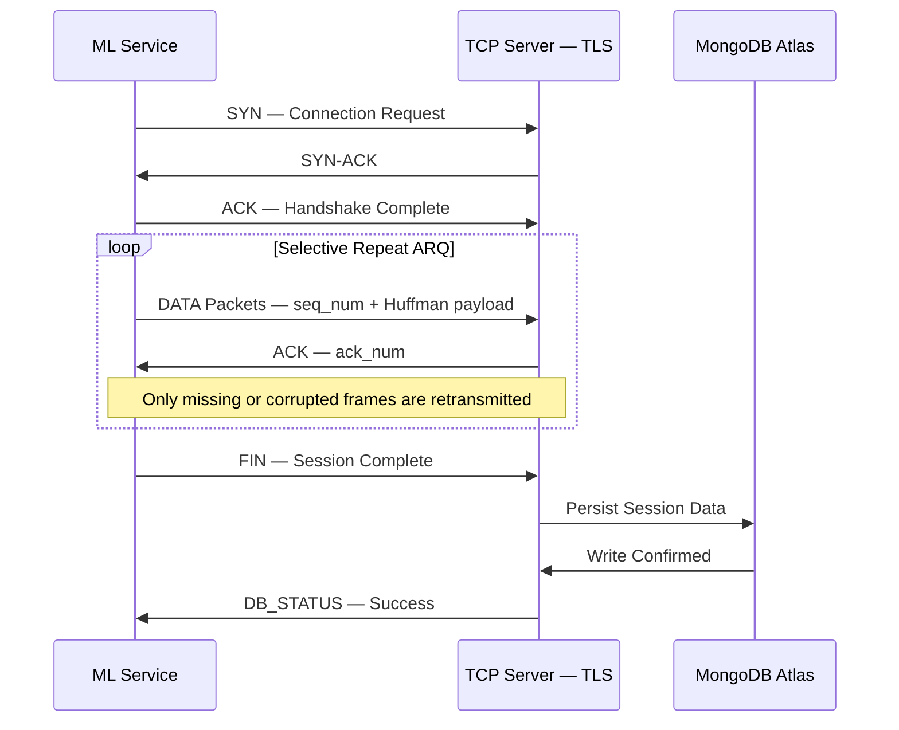

**Selective Repeat ARQ** — The sender maintains a sliding transmission window. Each frame is tagged with a unique sequence identifier. The receiver sends individual ACK/NAK responses per frame, and only missing or corrupted frames are retransmitted. Out-of-order frames are buffered in a circular queue and reassembled in sequence before processing.

**TCP Reno Congestion Control** — Four phases are implemented:

- **Slow Start** — Probes network capacity with an exponentially increasing congestion window from an initial conservative rate
- **Congestion Avoidance** — Transitions to linear (additive increase) throughput growth once the slow-start threshold is reached
- **Fast Retransmit** — Triggers immediate retransmission upon detection of three duplicate ACKs, signaling a likely packet loss event
- **Fast Recovery** — Adjusts the congestion window and slow-start threshold without collapsing to the initial state, preserving available bandwidth

**Huffman-Compressed Transport** — Joint angle sequences are compressed using a custom Huffman coding implementation before transmission. Compression is lossless — no data is discarded. Per-session statistics track original bit count versus compressed bit count, enabling bandwidth efficiency analysis.

---

## 10. Screenshots

### Authentication

<p align="center">
  
  <br/><em>Figure 4 — Role-based registration interface for patients and doctors</em>
</p>

<p align="center">
  
  <br/><em>Figure 5 — Secure authentication with role-based session routing</em>
</p>

### Patient Dashboard

<p align="center">
  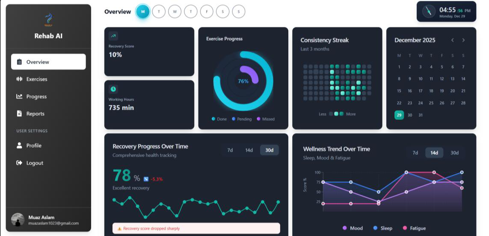
  <br/><em>Figure 6 — Patient overview: recovery trends, activity heatmap, exercise progress ring, and wellness metrics</em>
</p>

### AI Exercise Session

<p align="center">
  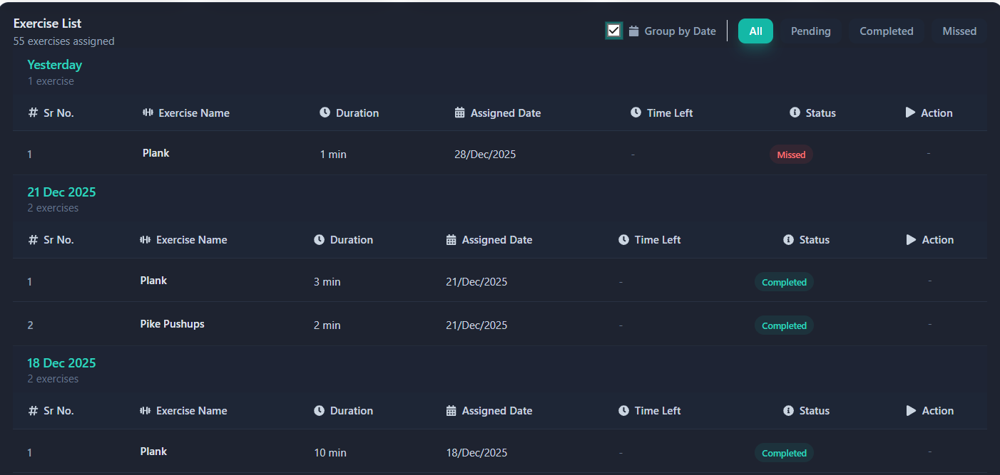
  <br/><em>Figure 7 — Real-time pose analysis with BiLSTM form classification and instant corrective feedback</em>
</p>

### Pain Heatmap

<p align="center">
  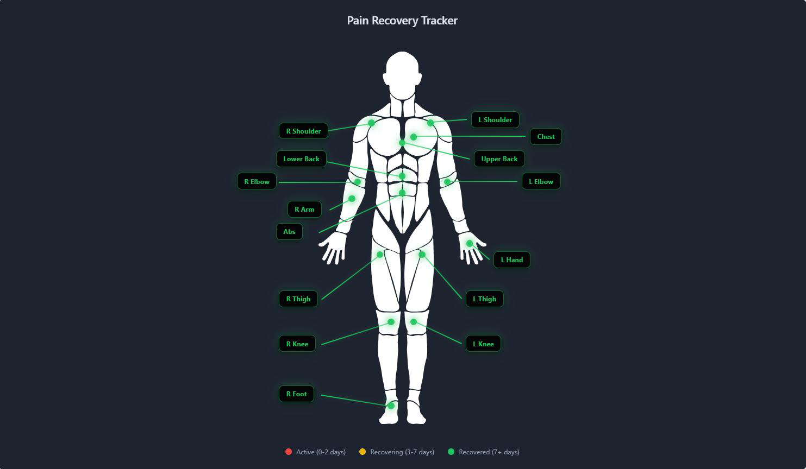
  <br/><em>Figure 8 — Interactive anatomical pain heatmap with multi-region selection and intensity tracking</em>
</p>

### Doctor Dashboard

<p align="center">
  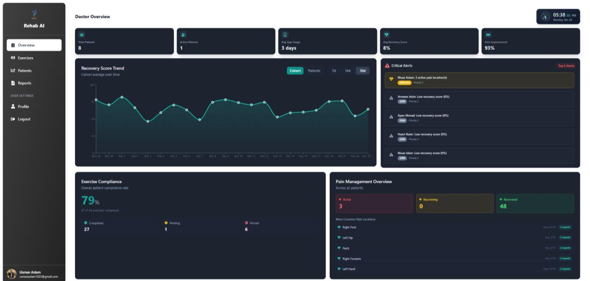
  <br/><em>Figure 9 — Doctor overview: cohort recovery trends, critical alerts, compliance metrics, and risk stratification</em>
</p>

### Performance Dashboard

<p align="center">
  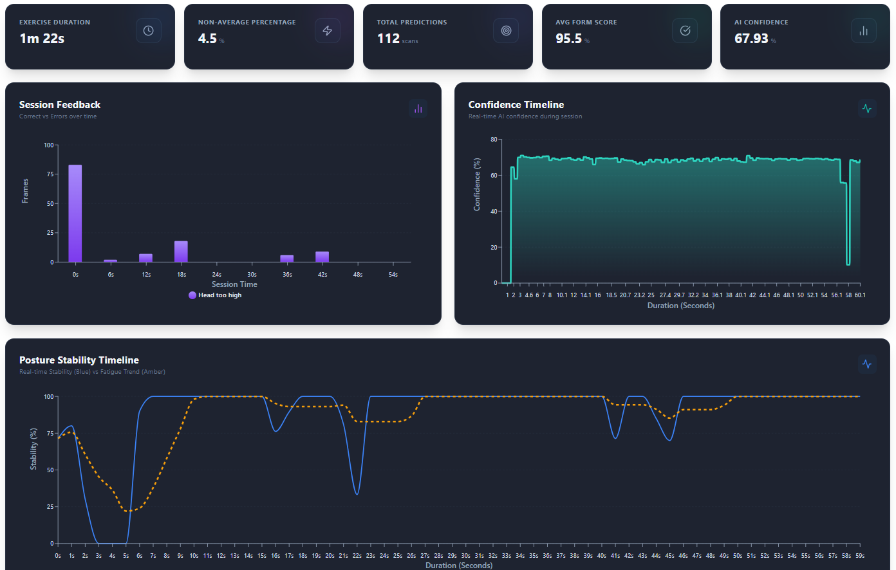
  <br/><em>Figure 10 — Patient daily exercise performance: Session Feedback, Posture Stability Timeline, Performance metrics, and Injury Risk</em>
</p>

### Reports Dashboard

<p align="center">
  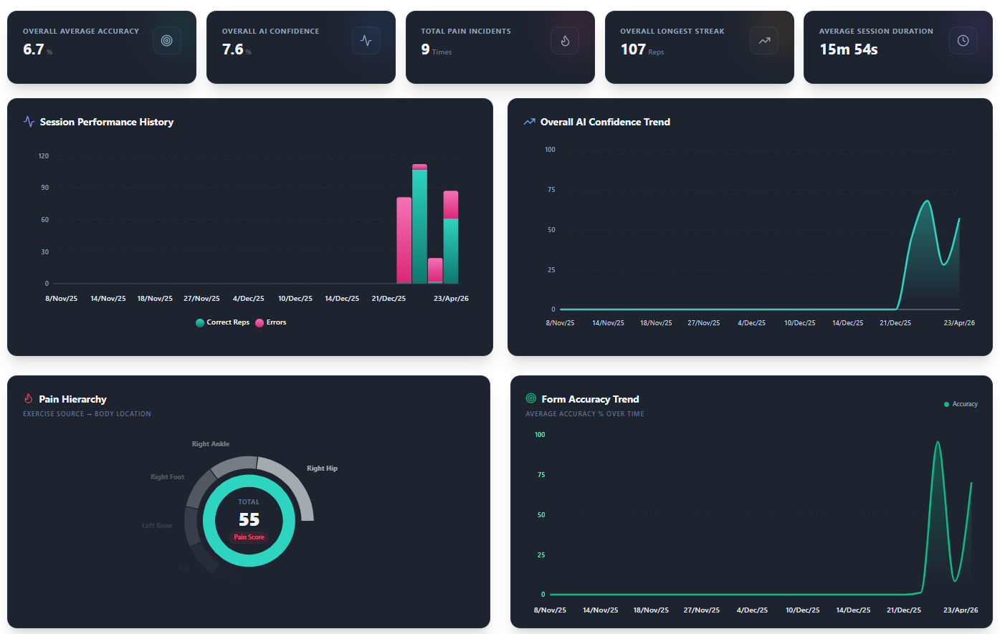
  <br/><em>Figure 11 — Patients Overall Performance overview: Session History, Pain Herarchy charts, Exercise Form Accuracy Charts and Pain Recovery</em>
</p>

---

## 11. Project Structure

```
rehab-ai/
├── backend/                              # Python FastAPI Backend
│   ├── main.py                           # App entry, CORS config, lifespan, subprocess management
│   ├── db_connection.py                  # MongoDB operations + DSA layer (Trie, Heap, Binary Search)
│   ├── token_manager.py                  # Cryptographic token generation and validation
│   ├── requirements.txt                  # Python dependencies
│   ├── .env.example                      # Environment variable template
│   │
│   ├── routes/
│   │   ├── auth_routes.py                # Login and signup endpoints
│   │   ├── data_routes.py                # Patient data, exercises, recovery metrics
│   │   ├── doctor_routes.py              # Doctor dashboard endpoints
│   │   ├── ml_routes.py                  # Video token generation
│   │   └── calories_routes.py            # Calorie prediction WebSocket and REST API
│   │
│   ├── ml/                               # ML Inference Service (port 8001)
│   │   ├── ml_server.py                  # FastAPI ML server with WebSocket endpoint
│   │   ├── pose_analysis.py              # PoseAnalyzer — BiLSTM inference pipeline
│   │   ├── pose_graph.py                 # Adjacency list graph for skeletal structure
│   │   ├── huffman_compression.py        # Huffman coding for angle data compression
│   │   ├── exercise_lstm_model.keras     # Trained CNN-BiLSTM model weights
│   │   └── scaler.pkl                    # Fitted RobustScaler for feature normalization
│   │
│   ├── tcp_control_flow/                 # Custom TCP Reliable Transport Protocol
│   │   ├── protocol.py                   # TCPPacket definition (SYN / ACK / FIN / DATA)
│   │   ├── sender.py                     # Reliable sender with Reno congestion control
│   │   ├── receiver.py                   # Reliable receiver with packet reassembly
│   │   └── socket_wrapper.py             # Async TLS socket abstraction layer
│   │
│   ├── calories_prediction/              # Calorie Prediction Module
│   │   ├── predict1.py                   # Vital sign recording (heart rate via FFT, temperature)
│   │   ├── predict2.py                   # Stacking ensemble prediction
│   │   └── saved_models/                 # Serialized .pkl model files (~64 MB)
│   │
│   └── network_sim/                      # Network statistics visualization utilities
│
├── frontend/                             # React + Vite Frontend
│   └── src/
│       ├── App.jsx                       # Root component with React Router
│       ├── context/AuthContext.jsx       # Authentication state management
│       └── components/
│           ├── Authentication/           # Login and signup forms
│           ├── Patient Dashboard/        # Patient views and AI video feed
│           └── Doctor Dashboard/         # Doctor views and patient management
│
├── screenshots/                          # UI screenshots and architecture diagrams
│   ├── architecture_diagram.png          # Layered architecture diagram (Section 3.1)
│   ├── block_diagram.png                 # System block diagram (Section 3.2)
│   └── ...                              # UI interface screenshots
├── generate_certs.py                     # TLS/SSL certificate generation script
├── .gitignore
└── README.md
```

---

## 12. Getting Started

### Prerequisites

| Requirement | Version | Download |
|---|---|---|
| **Python** | 3.13+ | [python.org](https://python.org/downloads/) |
| **Node.js** | 18+ | [nodejs.org](https://nodejs.org/) |
| **MongoDB Atlas** | — | [mongodb.com/atlas](https://mongodb.com/atlas) |

### Step 1 — Clone the Repository

```bash
git clone https://github.com/<your-username>/rehab-ai.git
cd rehab-ai
```

### Step 2 — Backend Setup

```bash
cd backend
python -m venv venv

# Windows
.\venv\Scripts\Activate.ps1

# macOS / Linux
source venv/bin/activate

pip install -r requirements.txt

# Configure environment variables
cp .env.example .env
# Edit .env with your MongoDB Atlas connection string
```

### Step 3 — ML Service Setup

```bash
cd backend/ml
python -m venv ml_venv

# Windows
.\ml_venv\Scripts\Activate.ps1

# macOS / Linux
source ml_venv/bin/activate

pip install tensorflow mediapipe numpy fastapi uvicorn
```

### Step 4 — Generate TLS Certificates

```bash
cd rehab-ai
python generate_certs.py
```

### Step 5 — Frontend Setup

```bash
cd frontend
npm install
```

### Step 6 — Run All Services

```bash
# Terminal 1 — Backend (automatically starts ML service and TCP server)
cd backend
.\venv\Scripts\Activate.ps1   # Windows
uvicorn main:app --reload

# Terminal 2 — Frontend
cd frontend
npm run dev
```

### Access Points

| Service | URL |
|---|---|
| **Frontend** | http://localhost:5173 |
| **Backend API** | http://localhost:8000 |
| **ML Service** | http://localhost:8001 *(auto-started)* |
| **TCP Server** | 127.0.0.1:65432 *(TLS)* |

---

## 13. Environment Variables

Create `backend/.env` from the provided template:

```bash
cp backend/.env.example backend/.env
```

```env
# backend/.env
MONGODB_URI=mongodb+srv://<username>:<password>@<cluster>.mongodb.net/?appName=<appName>
```

---

## 14. API Reference

### Authentication

| Method | Endpoint | Description |
|---|---|---|
| `POST` | `/api/login` | Authenticate user and return session token |
| `POST` | `/api/signup` | Register new user with role and profile picture |

### Patient Endpoints

| Method | Endpoint | Description |
|---|---|---|
| `POST` | `/api/activity/save` | Save daily wellness check-in data |
| `GET` | `/api/patient-exercises/{id}` | Retrieve all assigned exercises for a patient |
| `GET` | `/api/patient-exercises-advanced/{id}` | Exercises grouped and sorted via DSA layer |
| `POST` | `/api/complete-exercise` | Mark an assigned exercise as completed |
| `GET` | `/api/recovery-metrics/{id}` | Retrieve computed recovery score and metrics |
| `GET` | `/api/patient-pain-history/{id}` | Retrieve historical pain report data |

### Doctor Endpoints

| Method | Endpoint | Description |
|---|---|---|
| `GET` | `/api/patients/{doctor_id}` | Retrieve all patients sorted via Trie |
| `POST` | `/api/assign-exercise` | Assign an exercise to a patient |
| `GET` | `/api/doctor-alerts/{id}` | Retrieve priority alerts via Min-Heap |
| `GET` | `/api/doctor-recovery-trends/{id}` | Retrieve cohort-wide recovery trends |
| `GET` | `/api/doctor-patient-risks/{id}` | Retrieve risk-stratified patient list |

### ML & Video Endpoints

| Method | Endpoint | Description |
|---|---|---|
| `POST` | `/api/video/generate-token` | Generate single-use video feed access token |
| `WS` | `/ws/pose-analysis/{token}` | Real-time BiLSTM pose analysis stream |
| `WS` | `/ws/calories/vital-signs` | Vital signs recording WebSocket stream |
| `POST` | `/api/predict-calories` | Stacking ensemble calorie burn prediction |

---

## 15. Contributors

<table>
  <tr>
    <td align="center">
      <a href="https://github.com/MuazAslam">
        
        <br/><sub><b>Muaz Aslam</b></sub>
      </a>
    </td>
    <td align="center">
      <a href="https://github.com/ayan-ahmad">
        
        <br/><sub><b>Ayan Ahmad</b></sub>
      </a>
    </td>
    <td align="center">
      <a href="https://github.com/omer-ansar">
        
        <br/><sub><b>Omer Ansar</b></sub>
      </a>
    </td>
  </tr>
</table>


---

<div align="center">

<br/>

**Institute of Data Sciences — University of Engineering and Technology, Lahore**

*AI Care Specialist, Whenever You Needed, Wherever You Are*

<br/>

<sub>⚠️ This application is for educational and demonstration purposes. Ensure proper security measures before using in production environments.</sub>

<sub>For questions or support, please contact us through [GitHub Issues](../../issues).</sub>

<br/>

<sub>© 2026 REHAB AI. All rights reserved.</sub>

</div>
